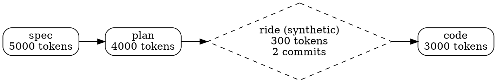

# Cowboy Mode Activity Attribution Specification (v2)

Track all development activity (git commits, tool usage, file edits, tokens) that occurs outside active workflows as implicit cowboy-mode workflow sessions.

## Overview

**What it does:** Attributes development activity (Claude Code hooks, git commits, file modifications, token usage) that occurs when no workflow is active to implicit "cowboy" workflow sessions, enabling complete project timeline visualization that accounts for all development activity.

**Key principles:**
- Any activity without an active workflow is implicitly a cowboy workflow session
- Cowboy sessions are complete workflow instances (workflow="cowboy", phase="ride")
- Workflows run to completion - never interrupted by cowboy sessions mid-workflow
- Cowboy sessions appear in project timeline between distinct workflow runs
- No explicit `hegel start cowboy` required for attribution
- Backward compatible with existing archives

**Scope:** Extends activity attribution and timeline visualization to track inter-workflow activity as synthetic cowboy workflow sessions.

**Integration context:**
- Builds on existing `src/metrics/hooks.rs` hook event parsing
- Extends `src/metrics/git.rs` commit parsing
- Extends `src/metrics/transcript.rs` token tracking
- Modifies `src/metrics/aggregation.rs` to identify inter-workflow gaps
- Extends timeline/graph visualization to show cowboy workflows
- Modifies `src/storage/archive.rs` schema for persistence
- Integrates with `hegel analyze` timeline output and `hegel top` TUI

## Data Model

### Cowboy Workflow Representation

Cowboy workflows can be either **explicit** (user ran `hegel start cowboy`) or **synthetic** (auto-detected inter-workflow activity).

**Synthetic cowboy workflow** (auto-detected):
```json
{
  "workflow_id": "2025-01-04T10:30:00Z",
  "mode": "cowboy",
  "completed_at": "2025-01-04T10:35:00Z",
  "phases": [
    {
      "phase_name": "ride",
      "start_time": "2025-01-04T10:30:00Z",
      "end_time": "2025-01-04T10:35:00Z",
      "duration_seconds": 300,
      "tokens": {
        "input": 1500,
        "output": 800,
        "cache_read": 200,
        "cache_creation": 100,
        "assistant_turns": 5
      },
      "bash_commands": [...],
      "file_modifications": [...],
      "git_commits": [...]
    }
  ],
  "transitions": [...],
  "totals": {...},
  "is_synthetic": true
}
```

**Key distinction:**
- `is_synthetic: true` - System inferred cowboy mode from inter-workflow activity
- `is_synthetic: false` - User explicitly ran `hegel start cowboy`
- `mode: "cowboy"` - Identifies this as a cowboy workflow

**Visual rendering:**
- **Synthetic cowboy**: Diamond shape (◆), dashed border, "(synthetic)" label
- **Explicit cowboy**: Normal rounded box (user-initiated workflow)

### Archive Structure

Cowboy sessions are stored as separate workflow archives, just like explicit workflows.

**Directory structure:**
```
.hegel/archive/
├── 2025-01-04T09:00:00Z.json    # WorkflowArchive (mode: "execution")
├── 2025-01-04T10:30:00Z.json    # WorkflowArchive (mode: "cowboy", is_synthetic: true)
└── 2025-01-04T11:00:00Z.json    # WorkflowArchive (mode: "discovery")
```

**Archive naming:**
- Archives named by workflow_id timestamp: `{workflow_id}.json`
- Workflow type determined by `mode` field inside archive
- Synthetic vs explicit determined by `is_synthetic` field inside archive

## Core Operations

### 1. Cowboy Workflow Detection & Creation

**Trigger:** `hegel archive` after completing a workflow

**Inputs:**
- All hook events (bash commands, file modifications)
- All transcript events (token usage)
- All git commits since project start
- List of archived workflows with their time ranges

**Process:**
1. Collect all timestamped activity from all sources
2. Identify activities whose timestamps fall outside any workflow's time range
3. Group inter-workflow activities by temporal proximity (1-hour threshold)
4. Aggregate all metrics for each group (tokens, commands, edits, commits)
5. Create synthetic cowboy workflow archives (`TIMESTAMP.json`) for each group
6. Store archives in `.hegel/archive/` alongside explicit workflow archives

**Examples:**

Activity before first workflow:
```
Timeline: [08:30 commit] → [09:00-10:00 execution workflow]
Result: Creates 2025-01-04T08:30:00Z.json (mode: "cowboy", is_synthetic: true)
```

Activity between workflows:
```
Timeline: [09:00-10:00 execution] → [10:15 edit, 10:20 commit] → [11:00-12:00 discovery]
Result: Creates 2025-01-04T10:15:00Z.json (mode: "cowboy", is_synthetic: true)
```

**Rules:**
- Only inter-workflow activity attributed to synthetic cowboy sessions
- Activities during explicit workflows never re-attributed
- Consecutive activities within 1 hour form single cowboy workflow
- Empty activity results in no cowboy archives created

**Error Handling:**
- Invalid timestamps: skip activity, log warning
- Malformed events: skip event, log error
- Missing data sources: work with available data
- Overlapping workflows: prefer explicit over synthetic

### 2. Complete Timeline Visualization

**All output modes include synthetic cowboy workflows with proper visual distinction.**

#### Analysis Output (`hegel analyze`)

```
Phase Breakdown

  SPEC (completed)
    Duration:          10m 00s
    Tokens:            5000
    Bash commands:     10
    File edits:        5
    Commits:           2

  PLAN (completed)
    Duration:          8m 00s
    Tokens:            4000
    Bash commands:     8
    File edits:        3
    Commits:           1

  RIDE (completed, synthetic)
    Duration:          5m 00s
    Tokens:            300
    Bash commands:     5
    File edits:        3
    Commits:           2

  CODE (active)
    Duration:          -
    Tokens:            -
```

**Rules:**
- Synthetic workflows appear inline with explicit workflows
- Marked with "(synthetic)" label in phase name line
- Same metrics displayed as explicit workflows
- Chronological ordering preserved

#### DOT Export (`hegel analyze --export-dot`)



**Rules:**
- Synthetic cowboy workflows rendered as diamond nodes with dashed borders
- Explicit cowboy workflows rendered as rounded boxes (normal)
- Node labels include "(synthetic)" indicator for synthetic workflows
- Shows aggregated metrics (tokens, commits, duration)

#### TUI Dashboard (`hegel top`)

```
┌─ Phases ────────────────────────────┐
│ SPEC (completed)                    │
│   Duration: 10m 00s                 │
│   Tokens: 5000                      │
│                                      │
│ RIDE (completed, synthetic) ◆       │
│   Duration: 5m 00s                  │
│   Tokens: 300                       │
│   Commits: 2                        │
│                                      │
│ CODE (active)                       │
│   Duration: -                       │
└──────────────────────────────────────┘
```

**Rules:**
- Synthetic phases marked with diamond icon (◆)
- "(synthetic)" label in phase header
- Same interaction as explicit phases (scrolling, selection)
- Real-time updates include synthetic phases

### 3. Archive Repair (`hegel analyze --fix-archives`)

**Purpose:** Backfill synthetic cowboy workflows for historical archives

**Process:**
1. Scan all existing archives to identify time gaps
2. Search for activity in gaps between archived workflows
3. Create synthetic cowboy archives for historical inter-workflow activity
4. Report created archives and metrics

**Example:**

Before repair:
```
.hegel/archive/
├── 2025-01-04T09:00:00Z.json    # mode: "execution"
└── 2025-01-04T11:00:00Z.json    # mode: "discovery"
```

After repair (detected activity at 10:30):
```
.hegel/archive/
├── 2025-01-04T09:00:00Z.json     # mode: "execution"
├── 2025-01-04T10:30:00Z.json     # mode: "cowboy", is_synthetic: true (Backfilled)
└── 2025-01-04T11:00:00Z.json     # mode: "discovery"
```

**Rules:**
- Only creates archives for gaps with actual activity
- Never modifies existing archives (only adds new ones)
- Respects same 1-hour grouping threshold
- Idempotent (safe to run multiple times)
- Supports `--dry-run` flag

## Test Scenarios

### Simple Case: Single Cowboy Session Between Workflows

**Input:**
- 2 explicit workflows: execution (09:00-09:30), discovery (11:00-11:30)
- 1 commit at 10:15 (between workflows)

**Expected:**
- 1 synthetic cowboy workflow created at 10:15
- Timeline: `execution -> cowboy (synthetic) -> discovery`
- DOT output contains diamond node for synthetic cowboy workflow

### Complex Case: Multiple Cowboy Sessions

**Input:**
- 3 explicit workflows: execution (09:00-09:30), discovery (11:00-11:30), research (15:00-15:30)
- 4 commits: 10:15, 10:20 (group 1), 13:00, 13:05 (group 2)

**Expected:**
- 2 synthetic cowboy workflows (grouped by 1-hour proximity)
- Timeline: `execution -> cowboy -> discovery -> cowboy -> research`
- Each synthetic cowboy workflow shows commit count in DOT

### Edge Case: Activity Before First Workflow

**Input:**
- First workflow starts at 09:00
- Commits at 08:30, 08:45 (before any workflow)

**Expected:**
- 1 synthetic cowboy workflow for pre-workflow activity
- Timeline: `cowboy (synthetic) -> execution -> ...`
- Archive includes pre-workflow cowboy session

### Edge Case: All Activity Within Workflows

**Input:**
- 2 workflows covering full timeline
- All commits fall within workflow time ranges

**Expected:**
- Zero synthetic cowboy workflows created
- Timeline shows only explicit workflows
- No synthetic archives created

### Integration: Archive Round-Trip

**Input:**
- Multiple workflows including synthetic cowboy workflows
- Serialize all to archive JSON files

**Expected:**
- Synthetic cowboy workflows stored as separate archive files
- `is_synthetic: true` flag preserved in archives
- Load archives reconstructs complete timeline
- Visualization identical after reload

## Success Criteria

### Core Functionality
- Inter-workflow activity attributed to synthetic cowboy workflows
- Activities grouped by temporal proximity (1-hour threshold)
- Synthetic workflow archives created in `.hegel/archive/`
- `is_synthetic` flag distinguishes inferred from explicit workflows

### Timeline Visualization
- All output modes display complete project timeline:
  - `hegel analyze` - ASCII Phase Breakdown
  - `hegel analyze --export-dot` - DOT graph
  - `hegel top` - TUI dashboard
- Synthetic cowboy workflows marked with "(synthetic)" label
- DOT export uses diamond shape + dashed border for synthetic
- TUI uses diamond icon (◆) for synthetic
- Temporal ordering preserved

### Persistence
- Synthetic cowboy workflows stored as separate archive files
- Archives follow naming convention: `TIMESTAMP.json`
- Round-trip serialization preserves cowboy data
- Backward compatible: old archives load successfully

### Archive Repair
- `hegel analyze --fix-archives` backfills historical cowboy workflows
- Only adds new archives, never modifies existing ones
- Idempotent (safe to run multiple times)
- Reports created archives and metrics

### Error Handling
- Missing git repository handled gracefully
- Invalid timestamps logged and skipped
- Overlapping workflows prefer explicit over synthetic
- Empty activity lists return no cowboy sessions

## Performance and Scaling

**Expected load:**
- Typical workflows: 5-20 phases, 10-100 commits
- Large projects: 100+ phases, 1000+ commits

**Performance requirements:**
- Commit attribution: O(n*m) where n=commits, m=phases - acceptable for n<1000
- Session grouping: O(n log n) - single sort pass
- Graph construction: O(phases) - no significant impact

**Memory:**
- Cowboy sessions stored in memory during analysis
- Archive size increase: ~100-500 bytes per cowboy session
- No streaming required for typical workloads

## Security and Validation

**Input validation:**
- Commit timestamps must be valid ISO 8601
- Phase time ranges must not be negative
- Git commit hashes must be valid hex strings

**Data integrity:**
- No mutations to existing phase metrics
- Cowboy sessions never modify explicit phase data
- Archive schema versioning for backward compatibility

**Privacy:**
- Git commit author emails stored as-is (user responsibility)
- No filtering of sensitive commit messages
- Archives contain full git history in scope
