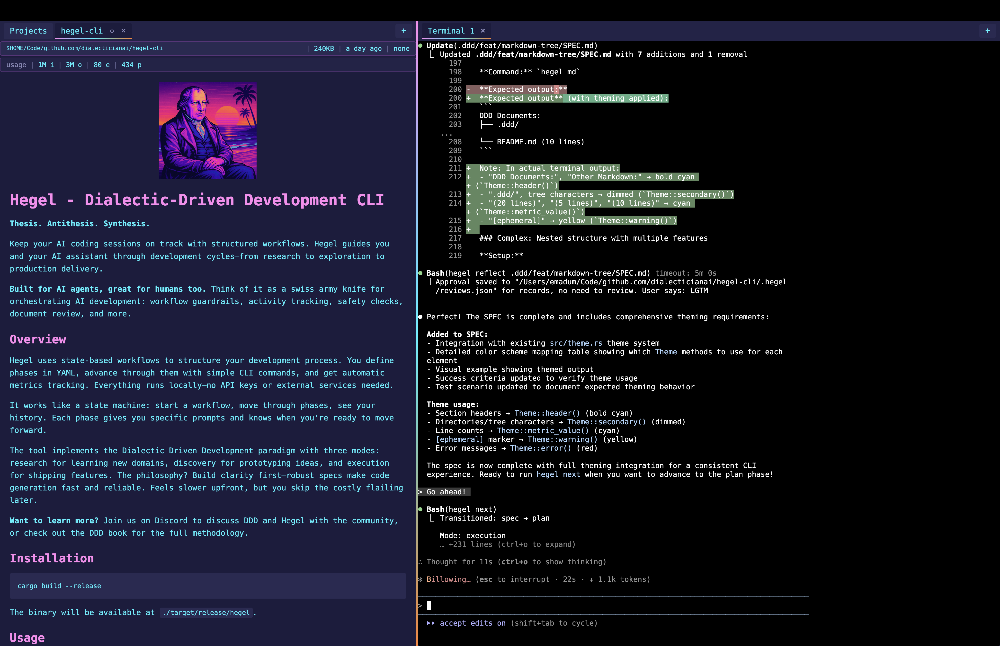

<p align="center">
  
</p>

# Hegel - Dialectic-Driven Development CLI

**Thesis. Antithesis. Synthesis.**

Keep your AI coding sessions on track with structured workflows. Hegel guides you and your AI assistant through development cycles—from research to exploration to production delivery.

**Built for AI agents, great for humans too.** Think of it as a swiss army knife for orchestrating AI development: workflow guardrails, activity tracking, safety checks, document review, and more.

## Overview

Hegel uses state-based workflows to structure your development process. You define phases in YAML, advance through them with simple CLI commands, and get automatic metrics tracking. Everything runs locally—no API keys or external services needed.

It works like a state machine: start a workflow, move through phases, see your history. Each phase gives you specific prompts and knows when you're ready to move forward.

The tool implements the Dialectic Driven Development paradigm with three modes: research for learning new domains, discovery for prototyping ideas, and execution for shipping features. The philosophy? Build clarity first—robust specs make code generation fast and reliable. Feels slower upfront, but you skip the costly flailing later.

**Want to learn more?** Join us on [Discord](https://discord.gg/YFB4Fy6bh8) to discuss DDD and Hegel with the community, or check out [the DDD book](https://dialecticianai.github.io/ddd-book/) for the full methodology.

<p align="center">
  
</p>

## Installation

```bash
cargo build --release
```

The binary will be available at `./target/release/hegel`.

## Usage

### Project Initialization

Bootstrap a new DDD project or retrofit DDD to an existing codebase:

```bash
hegel init
```

**What it does:**
- Automatically detects project type (greenfield vs retrofit)
- **Greenfield** (no non-.md files): Guides you through creating CLAUDE.md, VISION.md, and ARCHITECTURE.md
- **Retrofit** (existing code): Analyzes project structure and creates code maps in README.md files
- Walks through initialization workflow with prompts for each phase

**Configuration:**

Customize initialization behavior:

```bash
# View all settings
hegel config list

# Get specific setting
hegel config get code_map_style

# Set code map style (monolithic or hierarchical)
hegel config set code_map_style hierarchical
hegel config set code_map_style monolithic

# Toggle auto-launching reflect GUI after doc generation
hegel config set use_reflect_gui true
hegel config set use_reflect_gui false

# Control commit guardrails (default: true)
hegel config set commit_guard true
hegel config set commit_guard false

# Override git repository detection (default: auto-detect)
hegel config set use_git true
hegel config set use_git false
hegel config set use_git none  # Clear override, use auto-detect
```

Configuration is persisted to `.hegel/config.toml`.

### Declaring a Meta-Mode (Optional)

Optionally declare which meta-mode pattern you're following:

```bash
# For greenfield learning projects
hegel meta learning

# For standard feature development
hegel meta standard
```

Meta-modes enable higher-level workflow orchestration patterns but are not required for basic workflow usage.

**Available meta-modes:**
- `learning` - Greenfield learning project (Research ↔ Discovery loop, starts with research)
- `standard` - Feature development with known patterns (Discovery ↔ Execution, starts with discovery)

**View current meta-mode:**
```bash
hegel meta
```

### Starting Workflows

Start and transition between workflows:

```bash
# Start workflow at default beginning
hegel start discovery  # Starts at 'spec' phase
hegel start execution  # Starts at workflow's default start_node

# Start workflow at specific phase (useful for resuming or testing)
hegel start discovery plan     # Skip spec, start directly at plan
hegel start execution code     # Start directly at code phase
hegel start research study     # Start directly at study phase
```

**Custom start nodes:**
- Skips earlier phases in the workflow
- Useful for resuming interrupted workflows or testing specific phases
- History will only show nodes from the custom start point forward
- Validates node exists and provides helpful error with available nodes

Available workflows:
- `cowboy` - **DEFAULT** - Minimal overhead for straightforward tasks
- `init-greenfield` - Initialize new DDD project
- `init-retrofit` - Add DDD to existing project
- `research` - External knowledge gathering
- `discovery` - Optimized for learning density
- `execution` - Optimized for production delivery
- `refactor` - Focused refactoring workflow

### Listing Available Resources

Discover what workflows and guides are available:

```bash
# List all workflows (embedded + user-defined)
hegel workflows

# List all guides (embedded + user-defined)
hegel guides
```

Output shows where each resource comes from:
```
Available workflows:
  discovery (embedded, local)   # Both embedded and user-defined version exist
  execution (embedded)           # Only embedded version
  my-custom (local)              # User-defined only

Available guides:
  SPEC_WRITING.md (embedded, local)
  MY_GUIDE.md (local)
```

**See [CUSTOMIZING.md](docs/CUSTOMIZING.md) for details on creating custom workflows and guides.**

### Advancing Through Phases

Hegel provides ergonomic commands for common workflow transitions:

```bash
# Happy path: advance to next phase
hegel next

# Go back to previous phase (undo accidental advancement)
hegel prev

# Repeat current phase (e.g., after addressing feedback)
hegel repeat

# Restart workflow cycle (return to SPEC phase)
hegel restart

# Abandon current workflow and start fresh
hegel abort
```

**Guardrails:**
- Cannot start a new workflow while one is active - must run `hegel abort` first
- This prevents accidentally losing workflow progress
- Rules may block transitions (e.g., require commits, token budgets, timeouts)

**Bypassing rules:**

Force phase advancement when rules would otherwise block:

```bash
# Skip all rules
hegel next --force

# Skip specific rule type
hegel next --force require_commits
hegel next --force phase_timeout
```

**Advanced usage:**

For custom transitions, provide explicit claims. Claims are simple strings that trigger specific workflow transitions:

```bash
hegel next spec_complete        # Explicit claim
hegel next needs_refactor        # Custom transition (e.g., in execution workflow)
```

The `next` command automatically infers the happy-path claim (`{current_phase}_complete`) when no claim is provided.

### Stashing Workflows

Temporarily save your current workflow to switch contexts, similar to `git stash`:

```bash
# Save current workflow with optional message
hegel stash save -m "fixing auth bug"
hegel stash save                         # No message

# List all stashes (newest first)
hegel stash list

# Restore most recent stash and delete it
hegel stash pop

# Restore specific stash by index
hegel stash pop 1

# Delete stash without restoring
hegel stash drop
hegel stash drop 1                       # Delete specific index
```

**Stash format:**
```
stash@{0}: execution/code "fixing auth bug"  (2 hours ago)
stash@{1}: discovery/plan (yesterday)
```

**Common workflow:**
```bash
# Working on feature A at execution/code
hegel stash save -m "feature A in progress"

# Switch to urgent bugfix
hegel start discovery
# ... work on bugfix ...
hegel abort

# Resume feature A
hegel stash pop
```

**Guardrails:**
- Cannot stash if no active workflow
- Cannot pop stash if workflow is active (must `abort` or `stash` first)
- Stashes are stored in `.hegel/stashes/` with auto-indexing

### Checking Status

View your current workflow position:

```bash
hegel status
```

Shows:
- Current mode (discovery/execution)
- Current node/phase
- Full history of nodes visited

### Viewing Markdown Files

Visualize all markdown files in your project with categorization:

```bash
# Tree view with line counts
hegel md

# JSON output with full metadata
hegel md --json

# Exclude DDD artifacts (.ddd/, toys/, HANDOFF.md)
hegel md --no-ddd
```

**Categorization:**
- **DDD Documents**: Files in `.ddd/`, `toys/`, and `HANDOFF.md` (ephemeral)
- **Other Markdown**: All other `.md` files in the project

**Features:**
- Respects `.gitignore` rules (except HANDOFF.md is always shown)
- Themed tree output with line counts
- JSON mode includes file size, timestamps, and metadata
- Scans from current directory

**Example output:**
```
DDD Documents:
├── .ddd/
│   ├── SPEC.md (142 lines)
│   └── PLAN.md (89 lines)
└── HANDOFF.md (23 lines) [ephemeral]

Other Markdown:
├── README.md (234 lines)
└── guides/
    ├── SPEC_WRITING.md (187 lines)
    └── PLAN_WRITING.md (145 lines)
```

### Resetting State

Clear all workflow state:

```bash
hegel reset
```

## How It Works

Hegel uses YAML-based workflow definitions to guide you through development cycles. State is stored locally in `.hegel/state.json` (in your current working directory), making it a fully offline tool with no API keys or external dependencies required.

Each workflow defines:
- **Nodes** - Development phases with specific prompts
- **Transitions** - Rules for moving between phases based on claims
- **Mode** - Discovery (exploration) or Execution (delivery)

**Workflow snapshots** can be saved to `.hegel/stashes/` for later restoration, enabling context switching between tasks without losing progress.

## Dialectic-Driven Development

Hegel implements the Dialectic-Driven Development methodology across three operational modes:

### Research Mode (External Knowledge Gathering)
1. **Plan** - Define study priorities and scope
2. **Study** - Cache external sources, synthesize into learning docs
3. **Assess** - Meta-cognitive reflection on progress
4. **Questions** - Catalogue open questions as Discovery roadmap

**Use for**: Pre-implementation knowledge building, unfamiliar domains, systematic study of external sources

### Discovery Mode (Toy Experiments)
1. **Docs** - Generate SPEC.md and PLAN.md
2. **Tests** - Derive executable tests from specifications
3. **Implementation** - Minimal code to pass tests
4. **Learnings** - Extract insights and architectural decisions

**Use for**: Validating uncertainties, prototype implementations, answering questions from Research

### Execution Mode (Production Delivery)
Similar cycle to Discovery but with production-grade rigor, comprehensive error handling, and mandatory code review phase.

**Use for**: Building production features with validated patterns from Discovery

This methodology treats artifacts as disposable fuel while preserving clarity and constraints as durable value.

### When to Use DDD Workflows

**Hegel is a general workflow orchestration tool.** The DDD-opinionated guides included in this project (SPEC_WRITING, PLAN_WRITING, etc.) are defaults, not requirements.

**Start with cowboy mode (default):** Minimal overhead with just LEXICON guidance - use for most straightforward tasks.

**Escalate to full DDD workflows when:**
- Hard problems requiring novel solutions
- Projects needing extremely rigorous documentation
- Complex domains where mistakes are expensive
- Learning-dense exploration (discovery mode)

**Workflow selection:**
```bash
hegel start cowboy      # Default: minimal overhead
hegel start discovery   # Toy experiments with learning focus
hegel start execution   # Production-grade rigor
hegel start research    # External knowledge gathering
```

The full DDD workflow steps and accompanying token usage are designed for problems that **need** that rigor. Most tasks don't.

## Project Structure

```
hegel-cli/
├── src/
│   ├── main.rs          # CLI entry point
│   ├── commands/        # Command implementations
│   ├── engine/          # Workflow state machine (dual template engines)
│   │   ├── mod.rs       # Workflow definitions and routing
│   │   ├── handlebars.rs  # Handlebars template engine
│   │   └── template.rs  # Markdown template engine (legacy)
│   ├── storage/         # File-based state persistence
│   │   ├── reviews.rs   # Review management for .hegel/reviews.json (exported for hegel-mirror)
│   │   └── archive/     # Workflow metrics archiving
│   └── lib.rs           # Library exports for external tools
├── workflows/           # YAML workflow definitions
└── guides/              # Writing guides and templates
    ├── *.md             # Markdown guides
    ├── partials/        # Handlebars partials (.hbs files)
    └── templates/       # Markdown template fragments
```

## State Storage

**See [STATE.md](docs/STATE.md) for details on state file structure and configurable state directory options.**

## Integrations

**See [integrations/CLAUDE_CODE.md](docs/integrations/CLAUDE_CODE.md) for Claude Code hook events, metrics analysis, and interactive dashboard.**

## Command Wrapping with Guardrails

**See [GUARDRAILS.md](docs/GUARDRAILS.md) for configuring safety guardrails around dangerous commands.**

## Advanced Tools

**See [ADVANCED_TOOLS.md](docs/ADVANCED_TOOLS.md) for AST-based code transformation, document review, multi-project dashboard, and external agent orchestration.**

## Contributing

For AI agents or developers working **on** Hegel (not just using it), see **`CLAUDE.md`** for project structure, development guidelines, and contribution workflow.

## License

Server Side Public License v1 (SSPL)

## Learn More

Visit [dialectician.ai](https://dialectician.ai) for more information about Dialectic-Driven Development.
